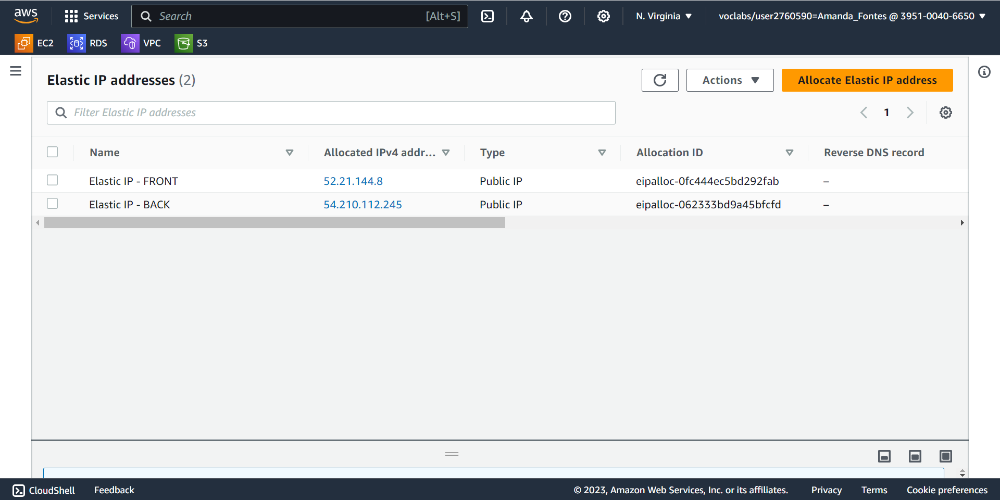
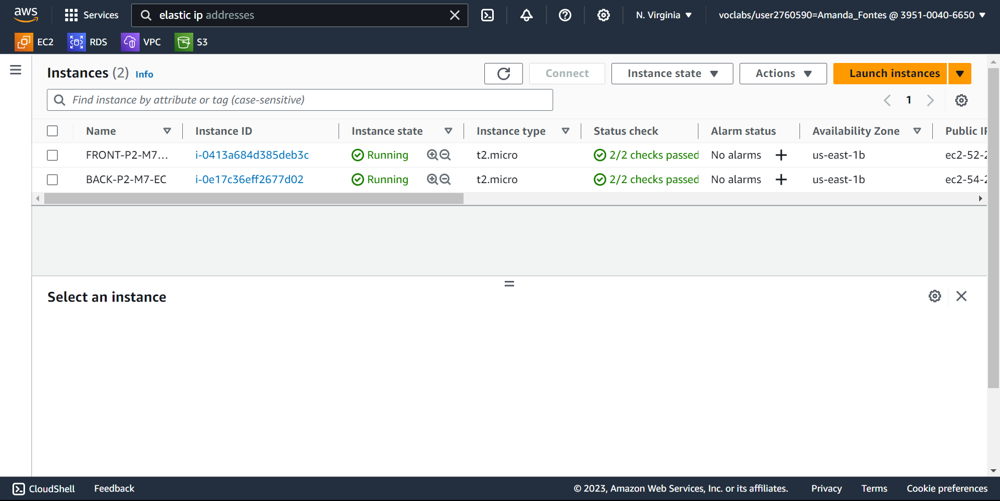
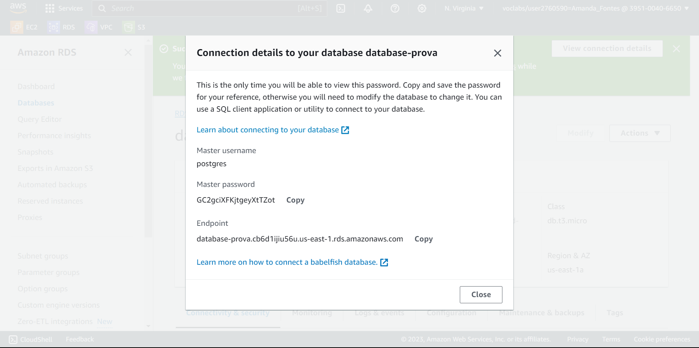
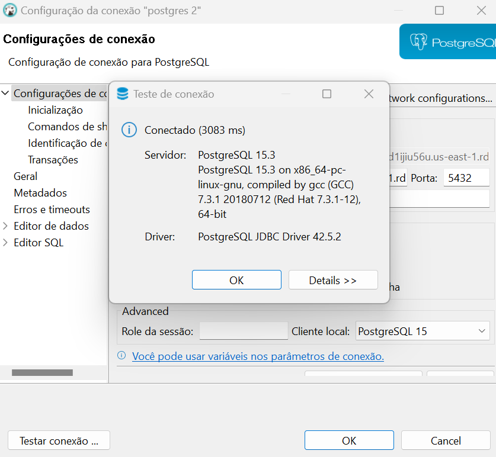
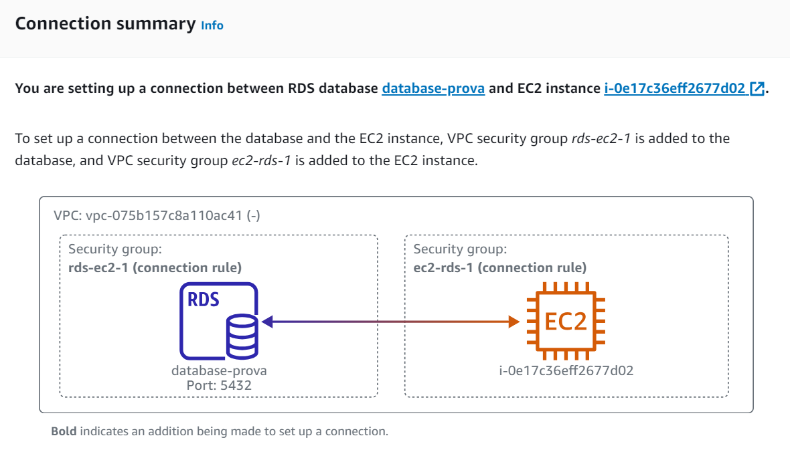
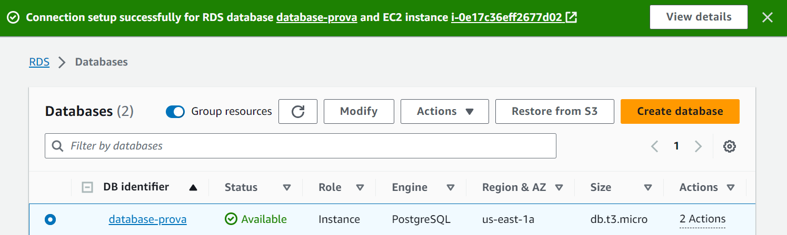

<h2>P2-M7-EC</h2>

O presente diretório destina-se à entrega da atividade prática da segunda prova do módulo.

<h3>Descrição</h3>

O objetivo desta atividade prática é que os alunos ganhem experiência na configuração e implantação de uma aplicação web simples na Amazon Web Services (AWS). Eles serão responsáveis por criar uma infraestrutura básica na AWS que inclui um front-end, um back-end e um banco de dados, além de configurar a comunicação entre esses elementos. Cada um desses recursos deve ser criado utilizando uma instância de EC2 para sua execução. O banco de dados pode ser criado utilizando o serviço de RDS.

<h3>Implementação</h3>

**Instância do back-end em máquina EC2**

Primeiramente, foi criada uma instância do back-end da aplicação em uma máquina virtual EC2. Para isso, foram necessárias as seguintes configurações:

<li>Amazon Machine Image (AMI): Ubuntu Server 22.04
<li>Instance type: t2.micro (1vCPU 1 GiB)
<li>Key pair: M7-Inteli-Keys

Network Settings:

<li>Allow SSH traffic from anywhere
<li>Allow HTTPS traffic from the internet
<li>Allow HTTP traffic from the internet

Posteriormente à criação da instância, foi associada à máquina um endereço Elastic IP.

**Modificações no back-end**

Quanto aos scripts que compõem o back-end da aplicação web, é importante destacar que as modificações necessárias foram realizadas. Tais modificações se referem aos detalhes do banco de dados: nome do banco, nome de usuário e senha para acesso ao banco, host do database gerado pela AWS uma vez que a instância foi criada e a porta de execução.

**Instância do front-end em máquina EC2**

A segunda máquina virutal EC2 criada foi destinada ao front-end da aplicação. As mesmas configurações foram adotadas e, assim como para a instância do back-end, foi associado um endereço de IP elástico.

</img>
 

As duas instâncias criadas no EC2 — tanto para o back-end quanto para o front-end — já se encontram em devida execução, como exibe a imagem abaixo.

</img>
 

**Instância do banco de dados no RDS**

A terceira instância solicitada refere-se ao banco de dados. Para a criação da instância, foi utilizado o RDS nas seguintes configurações:

<li>PostgreSQL: opção de engine selecionada
<li>Free tier: template escolhido
<li>DB instance identifier: nome para identificar a instância criada
<li>Master username: nome escolhido para o banco de dados
<li>Auto generate a password
<li>Instance configuration: db.t3.micro
<li>Storage: default values
<li>Connectivity: será conectado à instância EC2 do back-end, posteriormente
<li>Default VPC
<li>Public access: sim
<li>Database port: 5432
<li>Password authentication

Os detalhes de conexão são exibidos abaixo.

</img>
 

Embora a tabela do banco de dados ainda não houvesse sido criada, a conexão com o banco de dados foi testada utilizando o DBeaver, como é possível visualizar na imagem abaixo.

</img>
 

**Conexão entre banco de dados e back-end**

O próximo passo foi estabelecer a conexão entre a instância do banco de dados RDS e a máquina virtual EC2 referente ao back-end da aplicação. A conexão foi bem-sucedida, como é possível visualizar abaixo:

 

</img>
 

</img>
 

**Conexão entre back-end e front-end**

Prosseguindo com as etapas envolvidas na implementação, o próximo passo é estabelecer conexão entre o front-end e o back-end, uma vez que a interface desenvolvida consome a API e alimenta o banco de dados.